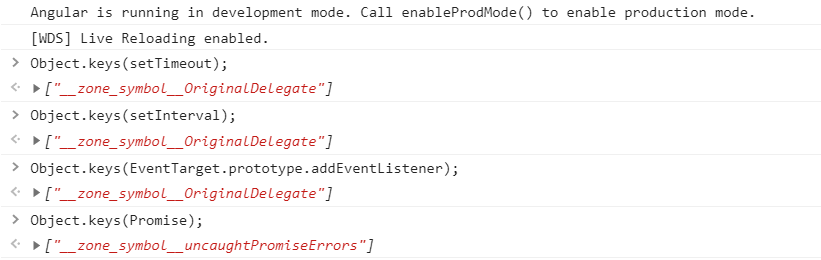

# Declarative and Zone-Less Angular Components With Ivy Features and NgRx

## TLDR; What's the goal?

To transform this:

```typescript
@Component({
  selector: 'app-movies',
  templateUrl: './movies.component.html',
})
export class MoviesComponent {
  movies$ = this.store.select(selectMovies);
  selectedMovie$ = this.store.select(selectSelectedMovie);

  constructor(private store: Store) {}

  onAddMovie(movie: string): void {
    this.store.dispatch(MoviesActions.addMovie({ movie }));
  }

  onUpdateSelectedMovie(selectedMovie: string): void {
    this.store.dispatch(MoviesActions.updateSelectedMovie({ selectedMovie }));
  }

  onRemoveSelectedMovie(): void {
    this.store.dispatch(MoviesActions.removeSelectedMovie());
  }
}
```

into this:

```typescript
@Component({
  selector: 'app-movies',
  templateUrl: './movies.component.html',
})
@ComponentFeatures([
  withSelectors({
    movies: selectMovies,
    selectedMovie: selectSelectedMovie,
  }),
  withActions(MoviesActions),
])
export class MoviesComponent {
  movies!: string[];
  selectedMovie!: string;
  actions!: typeof MoviesActions;
}
```

## Introduction

Let's first recap the concepts that are important for this article.

### What is Zone.js?

Zone.js a script that is executed before the Angular application is bootstrapped. It
[monkey patches](https://www.audero.it/blog/2016/12/05/monkey-patching-javascript/#what-is-monkey-patching)
asynchronous browser APIs (e.g. `setTimeout`, `setInterval`, `addEventListener`, `Promise`) by adding the code that will tell the Angular when
to run change detection mechanism. You can check that by opening the console in your Angular app and running the following code:



Angular wraps zone.js within the `NgZone` service. `ApplicationRef` injects it, listens to the `onMicrotaskEmpty` observable and invokes
`tick` method that will trigger the change detection mechanism.

```typescript
@Injectable()
export class ApplicationRef {
  constructor(private _zone: NgZone) {
    this._zone.onMicrotaskEmpty.subscribe(() => {
      this._zone.run(() => this.tick());
    });
  }
}
```

Zone.js tells Angular when to run the change detection, but it has a couple of downsides:

- Not tree shakable (uncompressed size >100kB)
- Slower application bootstrap speed
- Unnecessary change detection triggering
- Hard to debug
- Cannot monkey patch native async/await

### Trigger Change Detection Manually

If you exclude Zone.js from your Angular application, the change detection will not work.
To make it work again, you need to run change detection somehow. For that purpose, Angular has `ɵmarkDirty` function.
`ɵmarkDirty` accepts a component instance as an argument and when invoked, it will go up to the root component and schedule
change detection.

```typescript
import { Component, ɵmarkDirty } from '@angular/core';

@Component({
  selector: 'app-counter',
  template: `
    <h1>Counter</h1>
    <div>
      <button (click)="onIncrement()">+</button>
      <span>{{ count }}</span>
      <button (click)="onDecrement()">-</button>
    </div>
  `,
})
export class CounterComponent {
  count = 0;

  onIncrement(): void {
    this.count++;
    ɵmarkDirty(this);
  }

  onDecrement(): void {
    this.count--;
    ɵmarkDirty(this);
  }
}
```

And change detection works again! However, it's not awesome to trigger it manually every time when the state of component is updated.
You will probably miss calling `ɵmarkDirty` somewhere.

### Trigger Change Detection Automatically

Thankfully, there are few approaches how to trigger change detection automatically in zone-less environment:

1. [Push Pipe and RxLet Directive](https://youtu.be/wwx_KB49p3g) by Michael Hladky
   (see the prototype of `push` pipe [here](https://github.com/markostanimirovic/ng-under-the-hood/blob/master/src/app/zone-less-async.pipe.ts))
2. [Reactive Component](https://youtu.be/rz-rcaGXhGk) by Mike Ryan

Third approach is via Ivy Features. Let's take a closer look at them.

## Ivy Features

**UNDER_CONSTRUCTION**
