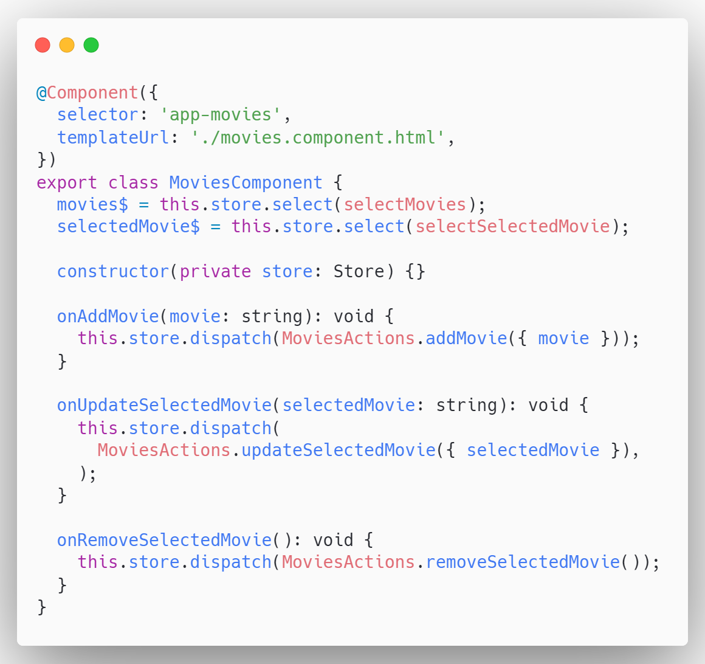
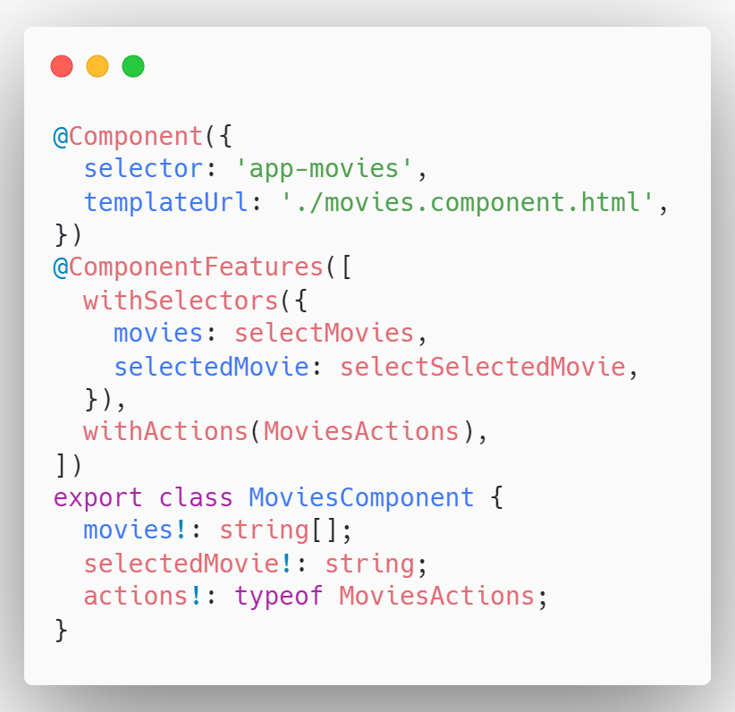
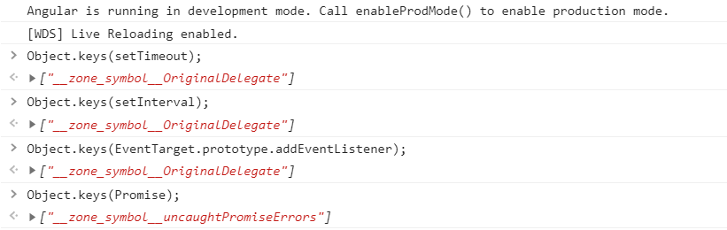
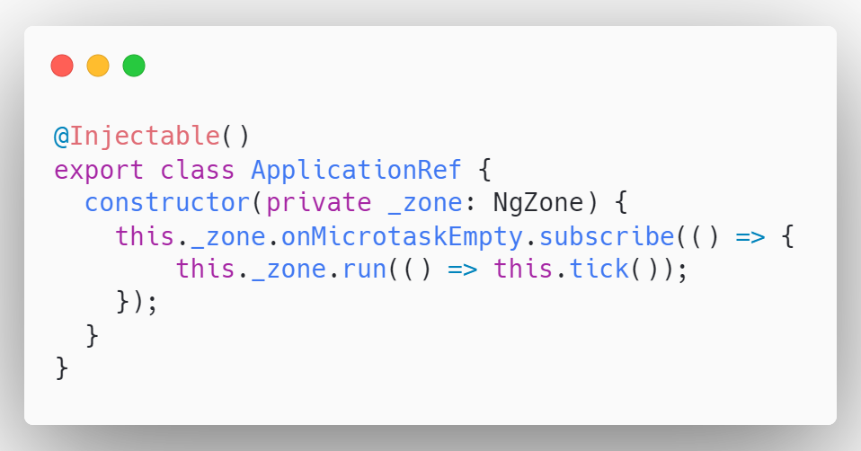

# Declarative and Zone-Less Angular Components With Ivy Features and NgRx

## TLDR; What's the goal?

To transform this:

into this:

## Introduction

Let's first recap the concepts that are important for this article.

### What is Zone.js?

Zone.js a script that is executed before the Angular application is bootstrapped. It
<a href="https://www.audero.it/blog/2016/12/05/monkey-patching-javascript/#what-is-monkey-patching" target="_blank">monkey patches</a>
asynchronous browser APIs (e.g. `setTimeout`, `setInterval`, `addEventListener`, `Promise`) by adding the code that will tell the Angular when
to run change detection mechanism. You can check that by opening the console in your Angular app and running the following code:

Angular wraps zone.js within the `NgZone` service. `ApplicationRef` injects it, listens to the `onMicrotaskEmpty` observable and invokes
`tick` method that will trigger the change detection mechanism.

#### Zone.js Downsides

- Not tree shakable (uncompressed size >100kB)
- Slower application bootstrap speed
- Unnecessary change detection triggering
- Hard to debug
- Cannot monkey patch native async/await

### Trigger Change Detection without Zone.js

Hopefully, there is `markDirty` function.

### How to Trigger Change Detection Automatically?

#### Reactive Component

#### Ivy Features

**UNDER_CONSTRUCTION**
